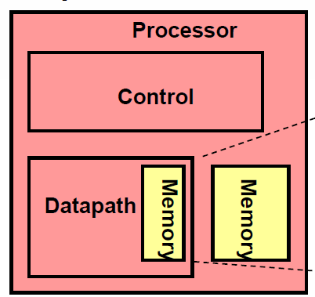
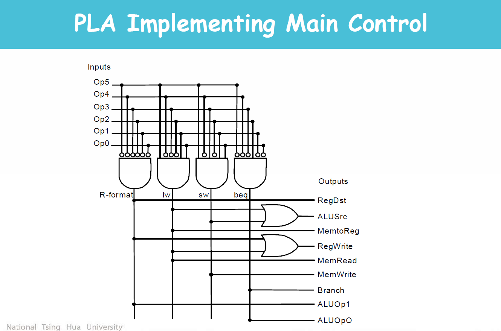
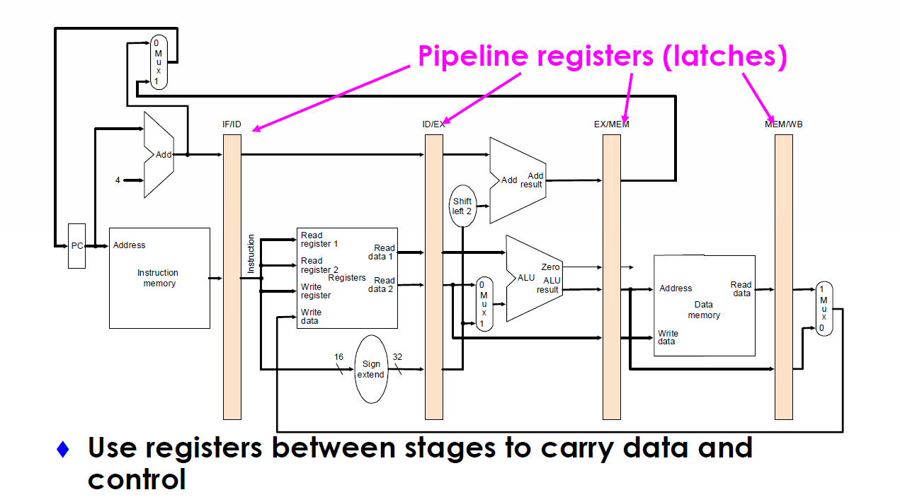

# CPU

An easy CPU implementation. The CPU block diagram:

The control unit logic diagram:

The pipeline datapath block diagram:

## Reference

> T.-T. Hwang, "Computer Architecture (CS4100)," OpenCourseWare, Department of Computer Science, National Tsing Hua University, Spring 2012. [Online]. Available: [https://ocw.nthu.edu.tw/ocw/index.php?page=course&cid=305&](https://ocw.nthu.edu.tw/ocw/index.php?page=course&cid=305&)
